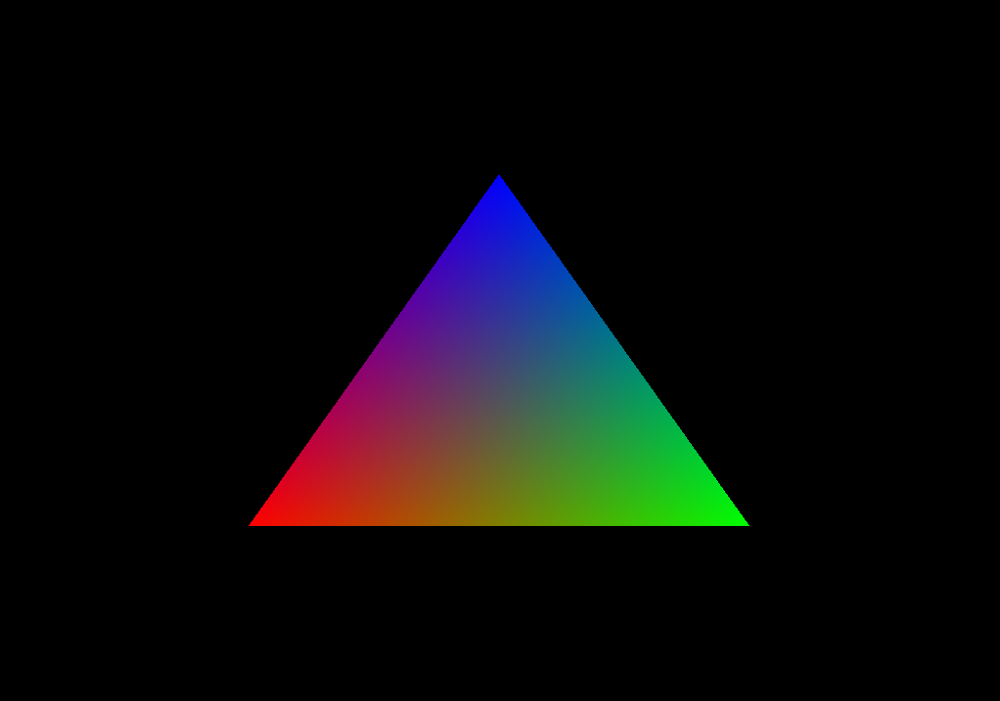

# OpenGLPlayground

OpengGLPlayground has no ambitions except to be a fun playground (as you may have understood) where I experiment with various features of openGL and realtime rendering cool stuff.

## Dependencies

This project uses different dependencies:

- [Assimp](https://github.com/assimp/assimp): Used to load model files to render 
- [Eigen](http://eigen.tuxfamily.org/index.php?title=Main_Page): Matrice and vector manipulation
- [Stbipp](https://github.com/Rodousse/stbipp): Image I/O
- [glfw](https://github.com/glfw/glfw.git): Window and context provider
- [Flix01/imgui](https://github.com/Flix01/imgui.git): Imgui fork with an additionnal file browser 
- [glew-cmake](https://github.com/Perlmint/glew-cmake.git): OpenGL extension wrangler
- [spdlog](https://github.com/gabime/spdlog.git): Log system

---


## Install

Whole install instructions:
```
git clone https://github.com/Rodousse/OpenGLPlayground.git
cd OpenGLPlayground
# Third party install 
cd third_party
mkdir build
cd build
cmake -DCMAKE_INSTALL_PREFIX="Wherever/you/want" .. 
make
# Project build
cd ../../project
mkdir build
cd build
cmake -DCMAKE_PREFIX_PATH="thirdParty/install/path/" ..
make
```

## Applications

### Triangle

The famous triangle as a first application



### Texture

Texture sampler properties and texture memory allocation


### 3D Model

3D model rendering of a scene, with a very simple shading (normal.dot(dir) with dir a uniform vec3)


### UBO

Again, 3D rendering of a scene, with this time a phong illumination. The parameters of the phong material and the light material are passed using a uniform buffer object.


### FBO

It may look quiet similar to the previous scene, but this application is using deferred rendering instead of forward rendering. Exercice using the framebuffer objects, stencil tests, and blitframebuffer (not optimal at all, could have used a pass through pipeline, but we can't say this application is resource consuming....)

